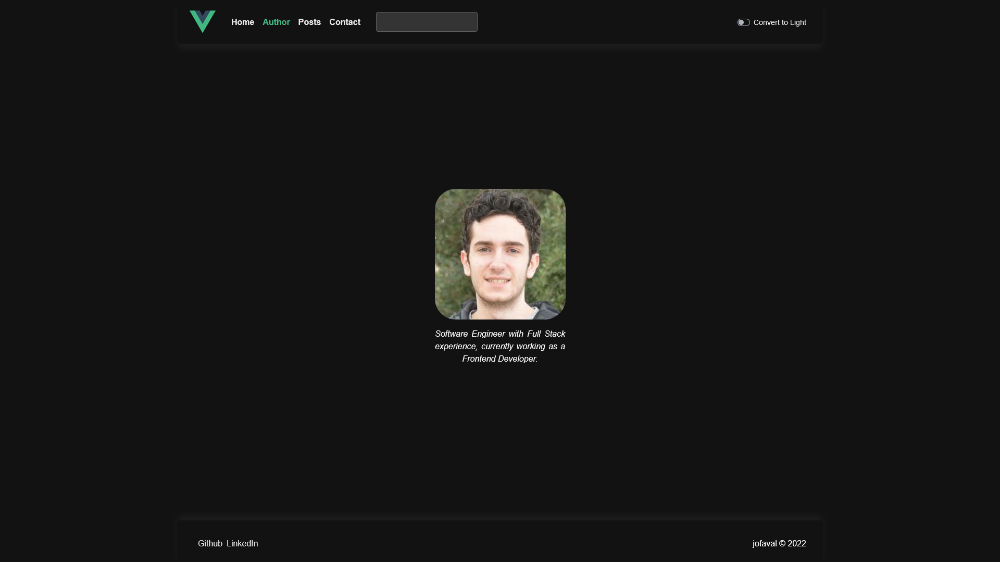

# JSON placeholder posts #

A frontend webapp using vue

## Description

It's the final project from a Bootcamp for Frontend in Vue. The idea is to develop a fully fleshed webapp using vue and other libraries that we saw along the way. As to provide content, [jsonplaceholder](https://jsonplaceholder.typicode.com/posts) will be used.

## Contents

1. [Documentation](#documentation)
1. [Objective](#objective)
    1. [Technical Goals](#technical-goals)
1. [Features](#features)
1. [Tech stack](#tech-stack)
1. [Disclaimer!!](#disclaimer)
1. [Quick tour](#quick-tour)
    1. [Home](#home)
    1. [Author](#author)
    1. [Posts](#posts)
    1. [Post detail](#post-detail)
    1. [User](#user)
    1. [Contact](#contact)
1. [How to set it up?](#how-to-set-it-up)
    1. [Pre-requisites](#pre-requisites)
    1. [Install](#install)
    1. [Use](#use)
1. [How to deploy?](#how-to-deploy)
    1. [Notice](#notice)
    1. [Using the CI/CD](#using-the-cicd)
1. [Testing](#testing)
    1. [How to execute all the tests in the system?](#how-to-execute-all-the-tests-in-the-system)
    1. [How to create a new test bench?](#how-to-create-a-new-test-bench)
    1. [How to create a new test?](#how-to-create-a-new-test)
1. [Usage](#usage)
    1. [Compiles and hot-reloads for development](#compiles-and-hot-reloads-for-development)
    1. [Compiles and minifies for production](#compiles-and-minifies-for-production)
    1. [Run your unit tests](#run-your-unit-tests)
    1. [Run your end-to-end tests](#run-your-end-to-end-tests)
    1. [Lints and fixes files](#lints-and-fixes-files)
    1. [Customize configuration](#customize-configuration)
1. [Credits](#credits)

## Documentation
[↑ Back to top](#contents)

For the docs please refer to the `/docs` folder, or with [this link](./docs/README.md).

## Objective
[↑ Back to top](#contents)

The main objective is to develop a webapp using vue. And also to develop a frontend project from start to finish.

### Technical Goals
[↑ Back to the section](#objective)

- Use Vue as the main frontend framework, Vue 2 to be specific.
- Route the pages, for that, we'll use Vue Router.
- Use axios to fetch information, VueAxios if possible.
- As to store information in memory, we'll use vuex, a state-management library for vue.
- Create custom components as we need them along the way.
- Use bootstrap or a similar library, tailwind may be an option, but bootstrap is far more popular.
- Use BEM (Block__Element--Modifier)

## Features
[↑ Back to top](#contents)

- Contact page
- Posts page
- Author page
- Navigation layout
- Footer

## Tech stack
[↑ Back to top](#contents)

- Vue2 + TypeScript
- The Vue ecosystem (vuex, VueAxios, vue-router)
- Bootstrap
- Jest + Testing Library

## Disclaimer!!
[↑ Back to top](#contents)

I do not own any of the data presented, therefore all the credit goes to it's rightful author [typicode](https://github.com/typicode).

## Quick tour

Just a quick view on what's the application visual feel. I'll use the dark theme as an example since is the one I've worked the most on and it's also the one I like the most, even though the design wasn't the main point of this project.

### Home
[↑ Back to top](#contents)

Home


### Author
[↑ Back to top](#contents)

Author


### Posts
[↑ Back to top](#contents)

Posts


### Post detail
[↑ Back to top](#contents)

Post detail


### User
[↑ Back to top](#contents)

User


### Contact
[↑ Back to top](#contents)


## How to set it up?
[↑ Back to top](#contents)

### Pre-requisites
[↑ Back to the section](#how-to-set-it-up)

- `node.js` >= 15.x.x compatibility.

### Install
[↑ Back to the section](#how-to-set-it-up)

```bash
git clone https://github.com/jofaval/gh-btc-vue-final.git
```

### Use
[↑ Back to the section](#how-to-set-it-up)

For the usage take a look at the [Usage](#usage)

## How to deploy?
[↑ Back to top](#contents)

### Notice
[↑ Back to the section](#how-to-deploy)

- The `public/` folder must always be the main one to use.
- If there's any media file that you want to add, use `src/assets/`.

### Using the CI/CD
[↑ Back to the section](#how-to-deploy)

Merge the changes to `main`.

## Testing
[↑ Back to top](#contents)

All the tests files will end in `.ts`, since we'll be using TypeScript.

- Unit tests files will end in `.spec.ts`
- End to end tests files will end in `.e2e.ts`

### How to execute all the tests in the system?
[↑ Back to the section](#testing)

```bash
npm test
```

### How to create a new test bench?
[↑ Back to the section](#testing)

Create a new `describe` call with the `name` and `lambda` function

```javascript
describe('Customer', () => {
});
```

### How to create a new test?
[↑ Back to the section](#testing)

Create a new `it` call with all the asserts you want

```javascript
describe('Customer', () => {
  it('should display all the information', () => {
    expect(<Customer />).not.toBe(null);
  })
});
```

## Usage
[↑ Back to top](#contents)

Set up the project by executing the following command at root level

```bash
npm install
```

### Compiles and hot-reloads for development
[↑ Back to the section](#usage)

```bash
npm run serve
```

Runs the app in the development mode. Open [http://localhost:3000](http://localhost:3000) to view it in your browser.

### Compiles and minifies for production
[↑ Back to the section](#usage)

```bash
npm run build
```

Used to build the solution into an optimized and compressed version

### Run your unit tests
[↑ Back to the section](#usage)

```bash
npm run test:unit
```

Runs all the unit test in the system and returns the information.

### Run your end-to-end tests
[↑ Back to the section](#usage)

```bash
npm run test:e2e
```

Runs all the e2e test in the system and returns the information.

### Lints and fixes files
[↑ Back to the section](#usage)

```bash
npm run lint
```

Lints all of the files so they're quality code

### Customize configuration
[↑ Back to the section](#usage)

See [Configuration Reference](https://cli.vuejs.org/config/).

## Credits
[↑ Back to top](#contents)

- To typicode for creating the json placeholder page [https://jsonplaceholder.typicode.com/posts](https://jsonplaceholder.typicode.com/posts).
- Geekshubs for the Bootcamp they've created.