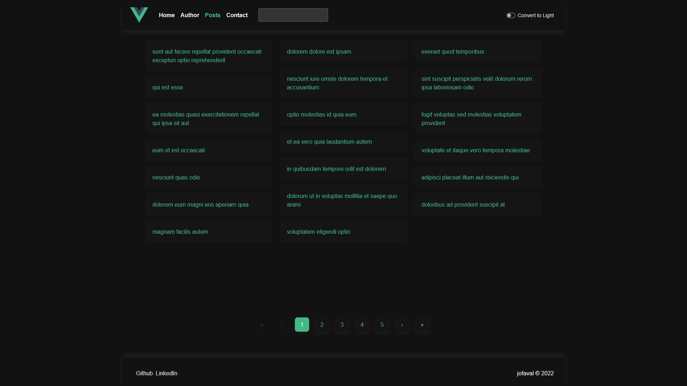
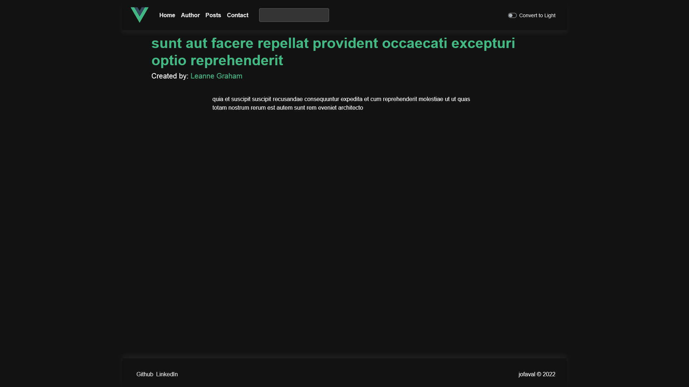
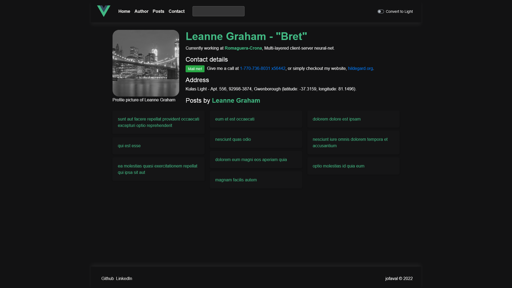
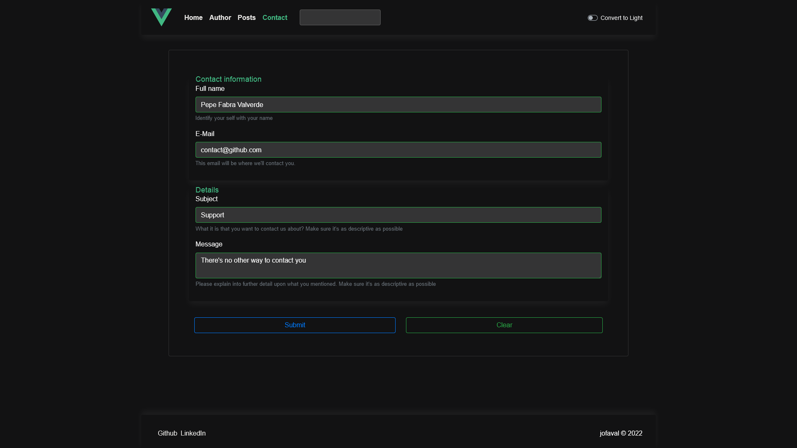

# KataIX - Posts & Users with Vue2 + Typescript #

&nbsp;

## Contents

1. [🖊️ Description](#-description)
1. [📓 Documentation](#-documentation)
1. [💡 Objective](#-objective)
    1. [🤩 Technical Goals](#-technical-goals)
1. [✨ Features](#-features)
1. [🎨 Design Pattern](#-design-pattern)
1. [📚 Tech stack](#-tech-stack)
    1. [📱 Frontend](#-frontend)
    1. [🧼 Clean code](#-clean-code)
    1. [🎬 CI/CD](#-cicd)
1. [🙌 Disclaimer!!](#-disclaimer)
1. [🔎 Quick tour](#-quick-tour)
    1. [🛖 Home](#-home)
    1. [😎 Author](#-author)
    1. [📰 Posts](#-posts)
    1. [📜 Post detail](#-post-detail)
    1. [🧑 User](#-user)
    1. [📲 Contact](#-contact)
1. [⚙️ How to set it up?](#-how-to-set-it-up)
    1. [📋 Pre-requisites](#-pre-requisites)
    1. [🪛 Install](#-install)
    1. [🛠️ Use](#-use)
1. [🌐 How to deploy?](#-how-to-deploy)
    1. [⚠️ Notice](#-notice)
    1. [☁️ Using the CI/CD](#-using-the-cicd)
1. [☑️ Testing](#-testing)
    1. [🗒️ How to execute all the tests in the system?](#-how-to-execute-all-the-tests-in-the-system)
    1. [✔️ How to create a new test bench?](#-how-to-create-a-new-test-bench)
    1. [✔️ How to create a new test?](#-how-to-create-a-new-test)
1. [🔖 Usage](#-usage)
    1. [🛠️ Compiles and hot-reloads for development](#-compiles-and-hot-reloads-for-development)
    1. [📦 Compiles and minifies for production](#-compiles-and-minifies-for-production)
    1. [☑️ Run your unit tests](#-run-your-unit-tests)
    1. [🖥️ Run your end-to-end tests](#-run-your-end-to-end-tests)
    1. [✍️ Lints and fixes files](#-lints-and-fixes-files)
    1. [🧰 Customize configuration](#-customize-configuration)
1. [🧐 Improvements](#-improvements)
1. [🥳 Conclusions](#-conclusions)
1. [😁 Credits](#-credits)

## 🖊️ Description
[⬆ Back to top](#contents)

It's the final project from a Bootcamp for Frontend in Vue. The idea is to develop a fully fleshed webapp using vue and other libraries that we saw along the way. As to provide content, [jsonplaceholder](https://jsonplaceholder.typicode.com/posts) will be used.

- Deployed at [https://jofaval.github.io/gh-btc-vue-final/](https://jofaval.github.io/gh-btc-vue-final/), it's responsive and also supports PWAs.
- Managed using Github Projects (beta), [BTC Geekshubs - Frontend in Vue - 2022/06](https://github.com/users/jofaval/projects/2) using a template ("Features" template) with a couple of tweaks here and there.
- There's even a wiki, if the format suits you better [https://github.com/jofaval/gh-btc-vue-final/wiki](https://github.com/jofaval/gh-btc-vue-final/wiki).
- It's licensed using the [MIT License](./LICENSE).

The changes are registered at the [CHANGELOG](./CHANGELOG.md), even though is not minute perfect, it's an orientation of the project's progress. I'm pretty sure there's plenty of little details that I've left in the drawer.

## 📓 Documentation
[⬆ Back to top](#contents)

For the docs please refer to the `/docs` folder, or with [this link](./docs/README.md).

## 💡 Objective
[⬆ Back to top](#contents)

The main objective is to develop a webapp using vue. And also to develop a frontend project from start to finish.

### 🤩 Technical Goals
[⬆ Back to the section](#-objective)

- Use Vue as the main frontend framework, Vue 2 to be specific.
- Route the pages, for that, we'll use Vue Router.
- Use axios to fetch information, VueAxios if possible.
- As to store information in memory, we'll use vuex, a state-management library for vue.
- Create custom components as we need them along the way.
- Use bootstrap or a similar library, tailwind may be an option, but bootstrap is far more popular.
- Use BEM (Block__Element--Modifier).

## ✨ Features
[⬆ Back to top](#contents)

- Contact page
  - A contact formulary that allows the user to contact us. It's validated in real time for a better user experience.
- Posts page
  - A page to visualize all of the posts and visualize them individually. It also allows for user (the post's author) visualization and to see which posts they wrote.
- Author page
  - The author of the application, a little description about me.
- Navigation layout
  - A navbar from where we can go everywhere we want in the app.
- Footer
  - A layout with the copyrights and some social media links.

The improvements are touched upon later on, [🧐 Improvements](#-improvements).

## 🎨 Design Pattern
[⬆ Back to top](#contents)

1. Functionality is always the first priority, there's nothing to style without features. It's not a design concept, but it's worth keeping in mind.
2. UX goes before the UI, a simple, native, uggly button can do if it's where it's supposed to be. UX may be the most important part of a feature (visually-wise).
3. UI goes last, it's usually a matter of browsing to get a moodboard (even mentally) of what you're looking for.

## 📚 Tech stack
[⬆ Back to top](#contents)

- Vue2 + TypeScript
- The Vue ecosystem (vuex, VueAxios, vue-router)
- Bootstrap

Made with vue-cli, first install the vue/cli package:

```shell
npm install -g @vue/cli
# OR
yarn global add @vue/cli
```

So that you can later create the project, or, for our case scenario, modify it.

```shell
vue create hello-world
```

```shell
vue add your-fav-package
```

### 📱 Frontend
[⬆ Back to the section](#-tech-stack)

- **TypeScript**
  - The static typed version of JavaScript, good for preventing errors before execution, and easier usage (since you should always know exactly what you're working with!)
- **vue.js**
  - One of the most used frontend framework, gaining more and more traction by the minute and for good reasons.
- **Vue's ecosystem**
  - **vue-router**
    - an intuitive approach to routing that allows and "enforces" for array-usage for routing.
  - **vuex**
    - a state management library that's being slowly replaced but pinia, still, it's a good state mangement library.
- **bootstrap-vue**
  - Bootstrap components and it's design pattern and implementations.
**jest + cypress**
  - The full package for a complete frontend testing experience, unit + e2e/integration.

### 🧼 Clean code
[⬆ Back to the section](#-tech-stack)

- **eslint (airbnb) + prettier**
  - Having a good style in the code is crucial for a scalable and maintanable codebase, and to automate the process as to avoid mistakes, it's almost a must nowadays.

### 🎬 CI/CD
[⬆ Back to the section](#-tech-stack)

- **Github Actions**
  - A free CI/CD, and easy to configure for any public github repository, it's a new trend and with tons of community contributions.

## 🙌 Disclaimer!!
[⬆ Back to top](#contents)

- I do not own any of the data presented, therefore all the credit goes to it's rightful author [typicode](https://github.com/typicode).
- Github Pages doesn't retain the vue-router information on my application, only the homepage loads properly.
- For the theme to change on responsive devices you'll have to adapt the theme on the setting's device and refresh the application.
- I'm no QA, the testing side of the application has a lot of room to grow and explore, of that I'm sure.

## 🔎 Quick tour
[⬆ Back to top](#contents)

Just a quick view on what's the application visual feel. I'll use the dark theme as an example since is the one I've worked the most on and it's also the one I like the most, even though the design wasn't the main point of this project.

### 🛖 Home
[⬆ Back to the section](#-quick-tour)

Home


### 😎 Author
[⬆ Back to the section](#-quick-tour)

Author


### 📰 Posts
[⬆ Back to the section](#-quick-tour)

Posts



### 📜 Post detail
[⬆ Back to the section](#-quick-tour)

Post detail



### 🧑 User
[⬆ Back to the section](#-quick-tour)

User



### 📲 Contact
[⬆ Back to the section](#-quick-tour)



## ⚙️ How to set it up?
[⬆ Back to top](#contents)

You may want to check it out locally, if that were to be the case, this section will clarify how to do just that.

### 📋 Pre-requisites
[⬆ Back to the section](#-how-to-set-it-up)

- `node.js` >= 15.x.x compatibility.

### 🪛 Install
[⬆ Back to the section](#-how-to-set-it-up)

In the folder that you may want the project, execute the following command (on Git BASH if you're running a Windows).

This will clone (download) the repository locally on your device

```shell
git clone https://github.com/jofaval/gh-btc-vue-final.git
```

Then you'll need to install the dependencies (if node.js is not installed, please do so before this step at, [node.js](https://nodejs.org/es/download/)). I'm using the version `15.14.0`, which you can find at [15.14.0](https://nodejs.org/download/release/v15.14.0/)

```shell
cd gh-btc-vue-final
npm install
```

### 🛠️ Use
[⬆ Back to the section](#-how-to-set-it-up)

For the usage take a look at the [🔖 Usage](#-usage)

## 🌐 How to deploy?
[⬆ Back to top](#contents)

Deployment is the process in which, the project gets ready for ✨production✨ and it's available for your target audiance.

### ⚠️ Notice
[⬆ Back to the section](#-how-to-deploy)

- The `public/` folder must always be the main one to use.
- If there's any media file that you want to add, use `src/assets/`.

### ☁️ Using the CI/CD
[⬆ Back to the section](#-how-to-deploy)

Merge the changes to `main`.

## ☑️ Testing
[⬆ Back to top](#contents)

All the tests files will end in `.ts`, since we'll be using TypeScript.

- Unit tests files will end in `.spec.ts`
- End to end tests files will end in `.e2e.ts`

### 🗒️ How to execute all the tests in the system?
[⬆ Back to the section](#-testing)

You can execute the following command, but I wouldn't recomend it since it will run unit tests and then e2e tests, I prefer to execute them on their own.

```bash
npm test
```

You can check out the [🔖 Usage](#-usage) section for more details about it.

### ✔️ How to create a new test bench?
[⬆ Back to the section](#-testing)

Create a new `describe` call with the `name` and `lambda` function

```javascript
describe('Customer', () => {
});
```

### ✔️ How to create a new test?
[⬆ Back to the section](#-testing)

Create a new `it` call with all the asserts you want

```javascript
describe('Customer', () => {
  it('should display all the information', () => {
    expect(<Customer />).not.toBe(null);
  })
});
```

## 🔖 Usage
[⬆ Back to top](#contents)

Set up the project by executing the following command at root level, which you should have already done if you already did the [⚙️ How to set it up?](#-how-to-set-it-up)

```bash
npm install
```

### 🛠️ Compiles and hot-reloads for development
[⬆ Back to the section](#-usage)

```bash
npm run serve
```

Runs the app in the development mode. Open [http://localhost:3000](http://localhost:3000) to view it in your browser.

### 📦 Compiles and minifies for production
[⬆ Back to the section](#-usage)

```bash
npm run build
```

Used to build the solution into an optimized and compressed version

### ☑️ Run your unit tests
[⬆ Back to the section](#-usage)

```bash
npm run test:unit
```

Runs all the unit test in the system and returns the information.

### 🖥️ Run your end-to-end tests
[⬆ Back to the section](#-usage)

```bash
npm run test:e2e
```

Runs all the e2e test in the system and returns the information.

### ✍️ Lints and fixes files
[⬆ Back to the section](#-usage)

```bash
npm run lint
```

Lints all of the files so they're quality code

### 🧰 Customize configuration
[⬆ Back to the section](#-usage)

See [Configuration Reference](https://cli.vuejs.org/config/).

## 🧐 Improvements
[⬆ Back to top](#contents)

Some improvements that could be made to either the applicaion or the architecture that, either by time, or, mostly, level of experience with the stack, won't be developed:

- Searchbar for posts and users. That displays results grouped by posts and users so that the real user can find the match for what they may be looking for
- Generalize more the components, right now I feel they're to specific, I'd love nothing more than to make them as customizable as possible, but they're fine as they are and it may be overcomplicating the project.
- Improve the overall visual style and feel with a better ui, and probably UX.
- Greatly improve the responsive design so that it's as user-friendly as possible.
- Add internalization, strings are hardcoded and that's not scalable, let alone ready for mutlilanguage.
- Improve the form validation's user experience.
- Create components using arrays so that the logic is abstracted as possible.

## 🥳 Conclusions
[⬆ Back to top](#contents)

I barely had any sustantial idea of how Vue truly worked, how a beginner -> intermediate webapp in Vue, was made, coming from React there were some habits I had to take off, while there were solutions to problems I was used to. I can see why Vue it's such a strong framework and I'm starting to understand where it's power comes from.

Single File Components where kind of a shock, but in a good way, the official documentation is marvelous, and it's ecosystem it's truly one of a kind, it can seriously, not only rival React's one, but beat it. But, at the end of the day, they are two different approaches to the same goal, each with it's own pros and cons.

## 😁 Credits
[⬆ Back to top](#contents)

- To typicode for creating the json placeholder page [https://jsonplaceholder.typicode.com/posts](https://jsonplaceholder.typicode.com/posts).
- [Geekshubs Academy](https://bootcamp.geekshubsacademy.com/) for the Bootcamp they've created.