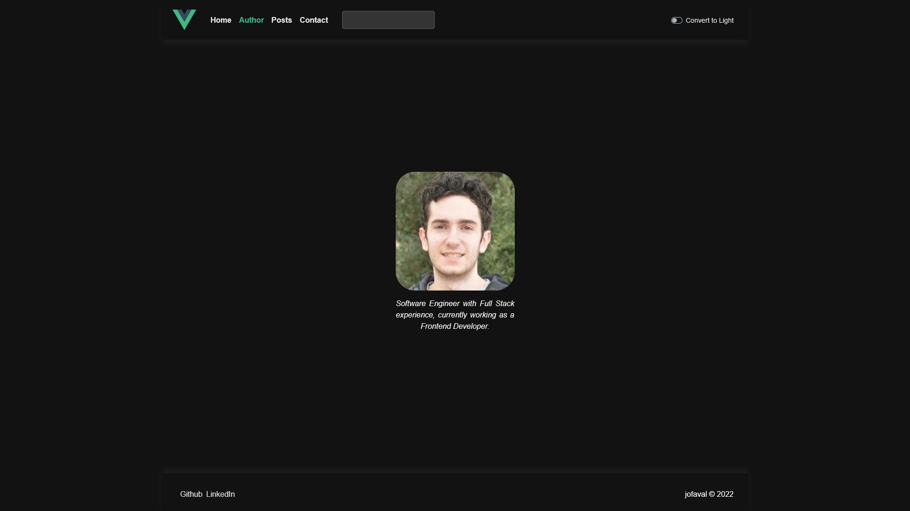
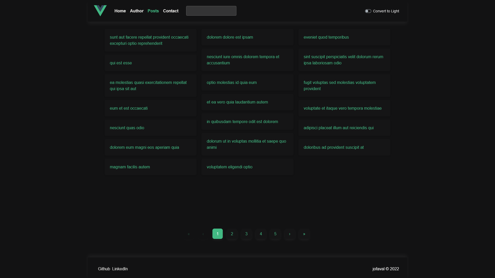
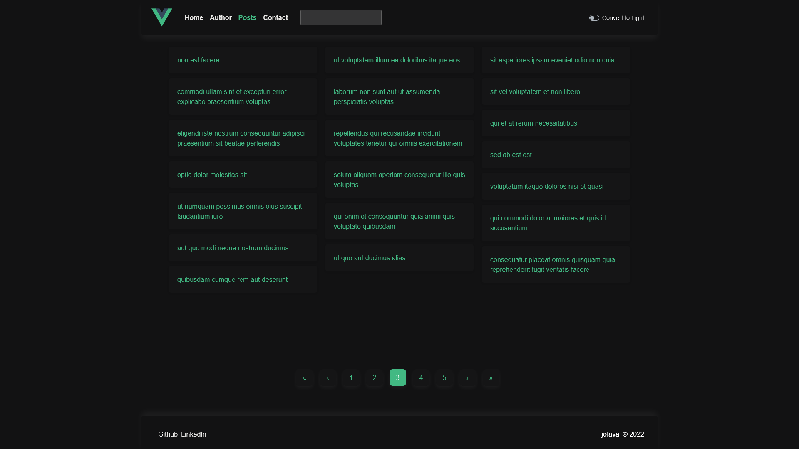
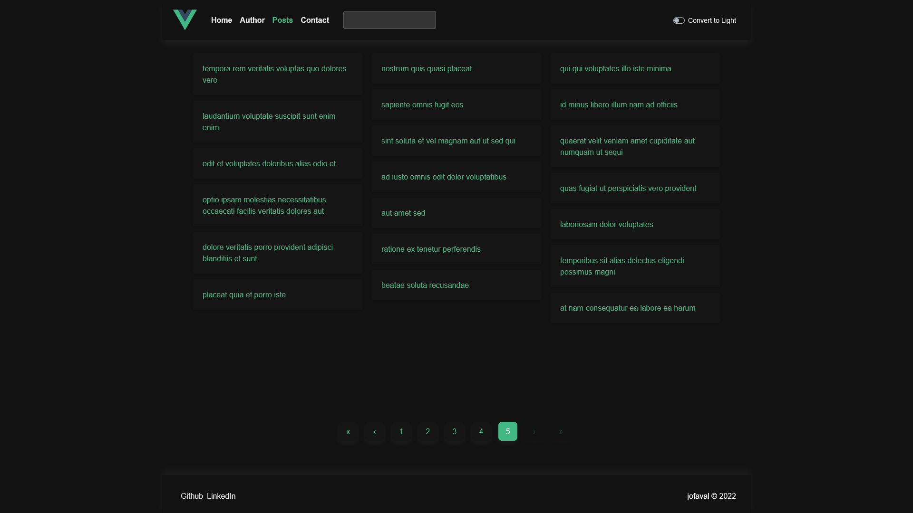
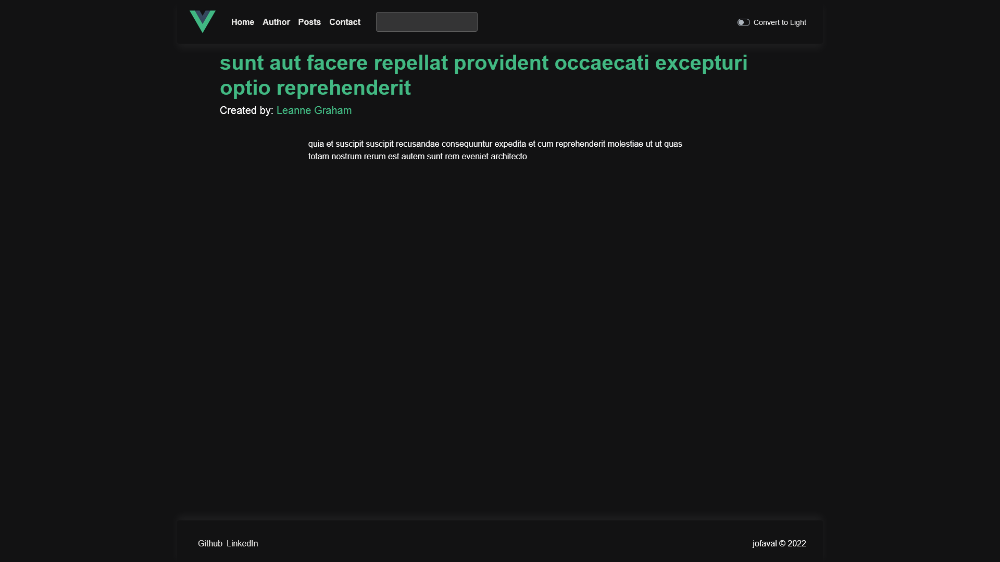
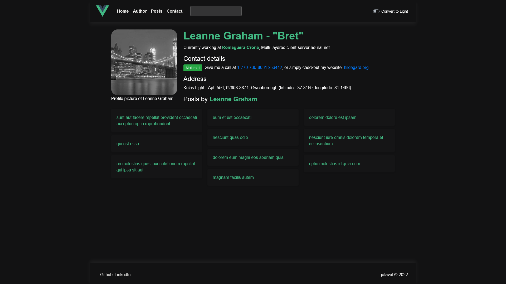
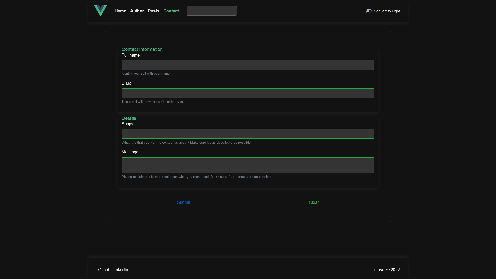
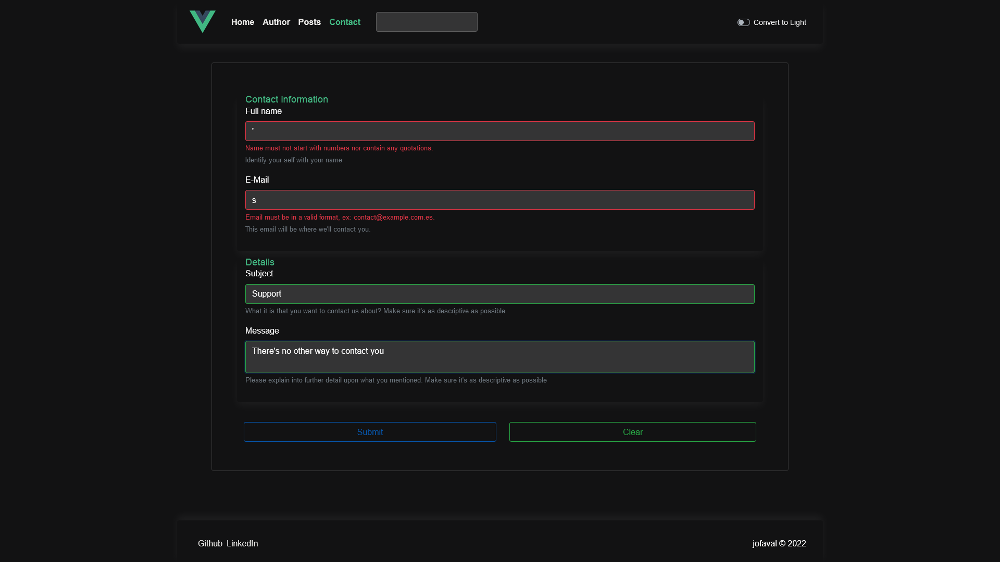
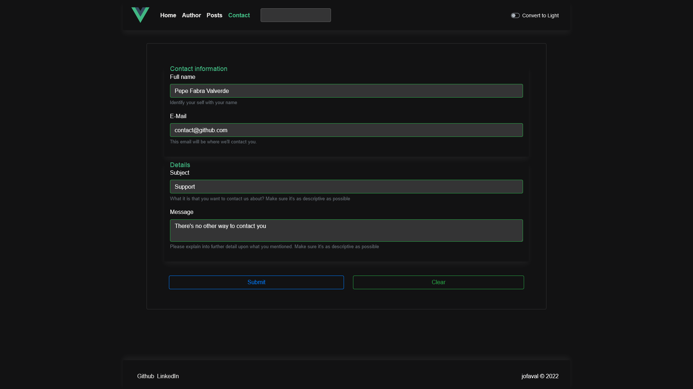
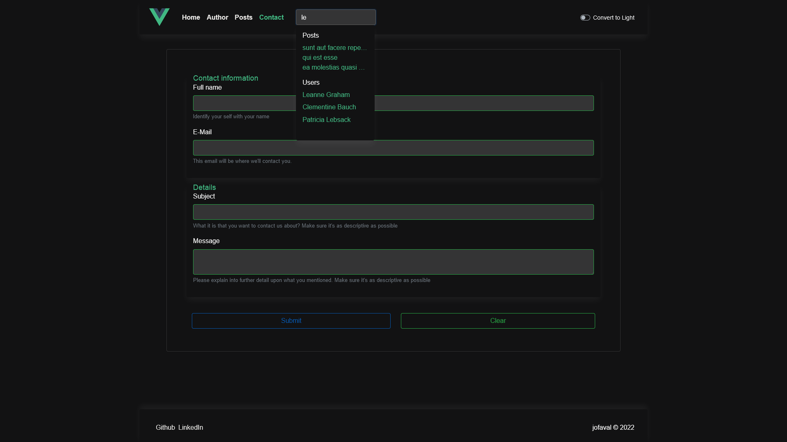

# Dark theme #

## Contents

1. [Home](#home)
1. [Author](#author)
1. [Posts](#posts)
1. [Post detail](#post-detail)
1. [User](#user)
1. [Navbar search](#navbar-search)
1. [Contact](#contact)

## Home
[↑ Back to top](#contents)

Home

## Author
[↑ Back to top](#contents)

Author

## Posts
[↑ Back to top](#contents)

Posts

Posts middle

Posts last

## Post detail
[↑ Back to top](#contents)

Post detail

## User
[↑ Back to top](#contents)

User

## Contact
[↑ Back to top](#contents)

Contact form empty

Contact form with a validation error

Contact form filled

## Navbar search
[↑ Back to top](#contents)

Navbar search

