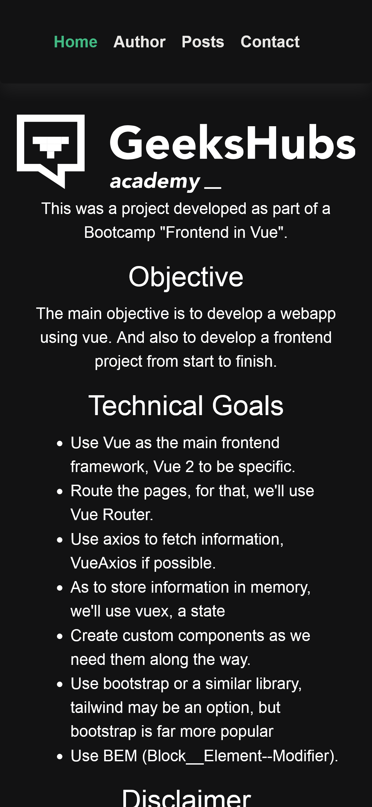
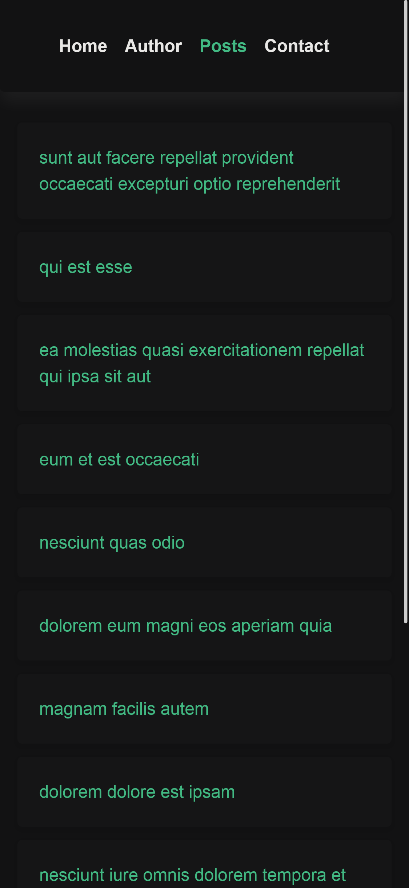
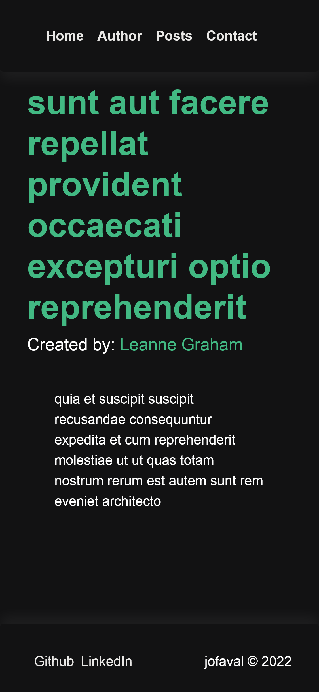
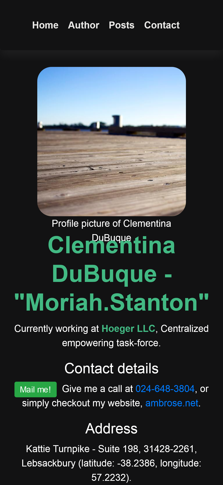
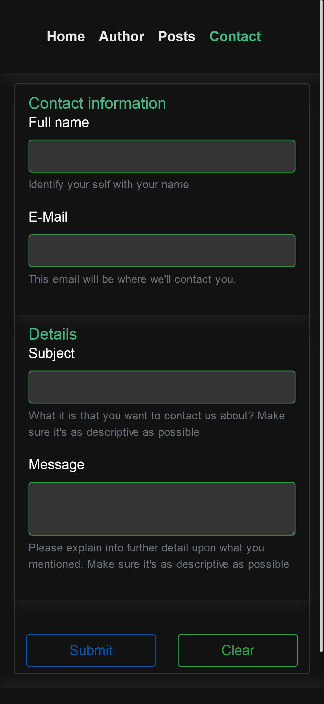
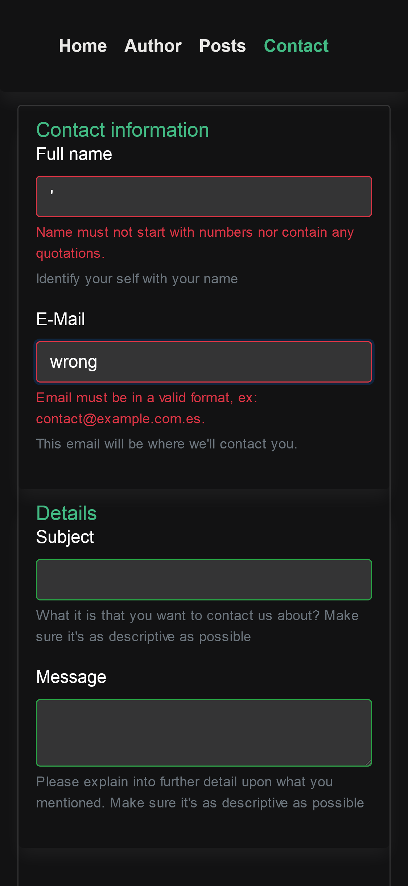

# Phone theme #

## Contents

1. [🛖 Home](#-home)
1. [😎 Author](#-author)
1. [📰 Posts](#-posts)
1. [📜 Post detail](#-post-detail)
1. [🧑 User](#-user)
1. [📲 Contact](#-contact)

## 🛖 Home
[↑ Back to top](#contents)

Home

## 😎 Author
[↑ Back to top](#contents)

Author

## 📰 Posts
[↑ Back to top](#contents)

Posts

## 📜 Post detail
[↑ Back to top](#contents)

Post detail

## 🧑 User
[↑ Back to top](#contents)

User

## 📲 Contact
[↑ Back to top](#contents)

Contact form empty

Contact form with a validation error

